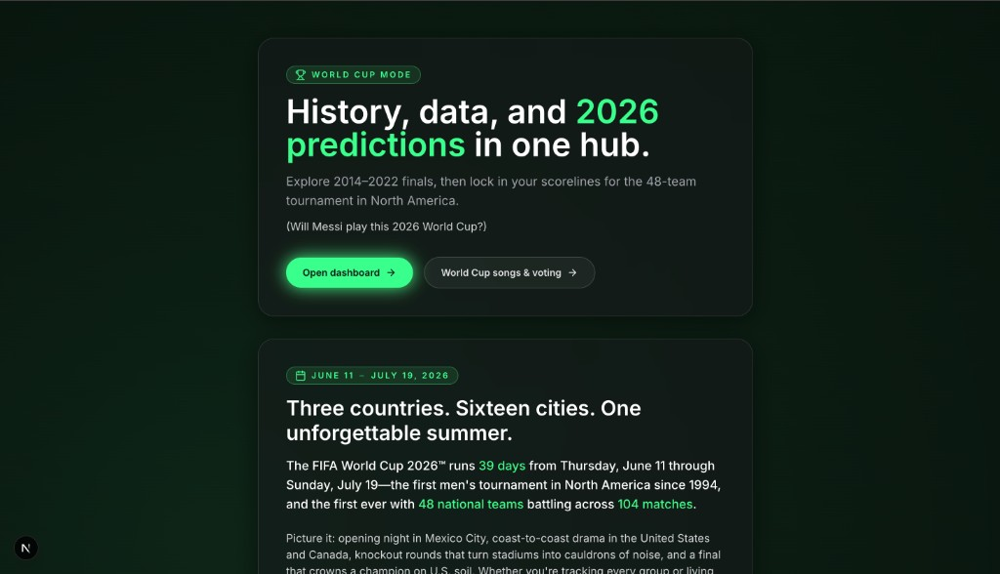
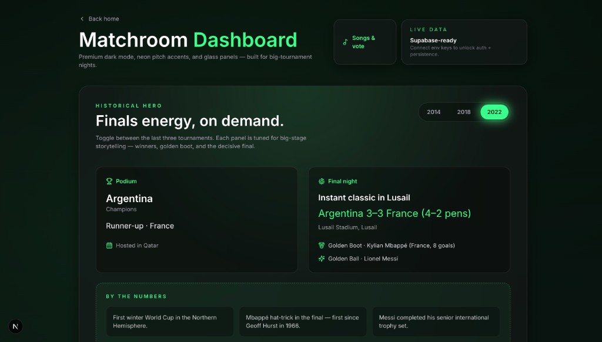
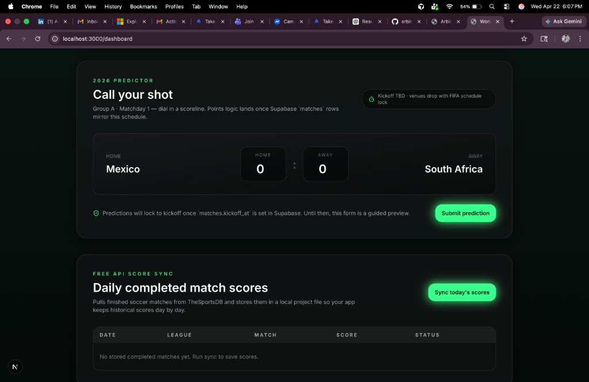

# 2026 Soccer World Cup

Interactive World Cup website built with Next.js, focused on history, fan storytelling, and 2026 tournament predictions.

**Official tournament hub:** [FIFA World Cup 2026™ — Canada, Mexico, USA](https://www.fifa.com/en/tournaments/mens/worldcup/canadamexicousa2026)

## Screenshots

**Landing — World Cup mode:** history, 2026 predictions, and event snapshot.

**Matchroom — historical finals:** year toggle (2014 / 2018 / 2022), podium, and final-night stats (Supabase-ready panel).

**Dashboard — 2026 predictor & score sync:** match scorelines, daily completed scores from TheSportsDB.

## Live demo

**[Deploy to Vercel (one click)](https://vercel.com/new/clone?repository-url=https%3A%2F%2Fgithub.com%2Farbinbudhathoki%2F2026-Soccer-WorldCup-)**

After the first production deploy, you will see a **production URL** on your Vercel project overview. Add a clickable **App** link in this README (same format as a normal markdown link) and set `NEXT_PUBLIC_SITE_URL` in Vercel to that exact URL (see `.env.example`) so link previews and Open Graph images stay correct on custom domains or stable Vercel URLs.

Example line you can add after you know the URL: `[open live site](https://<your-project>.vercel.app)`.

## Highlights

- World Cup themed homepage with modern glass/neon UI
- Historical tournament storytelling and stats
- Match prediction experience for the 2026 tournament
- Personal fan note section (Germany, Mesut Ozil inspiration)
- Built with reusable React components and Tailwind styling

## Tech Stack

- Next.js
- React
- TypeScript
- Tailwind CSS
- Supabase
- Framer Motion

## Run Locally

1. Clone the repo:
   `git clone https://github.com/arbinbudhathoki/2026-Soccer-WorldCup-.git`
2. Open the project folder:
   `cd 2026-Soccer-WorldCup-`
3. Install dependencies:
   `npm install`
4. Start development server:
   `npm run dev`
5. Open in browser:
   `http://localhost:3000`

## Deployment (Vercel)

1. Use [the deploy link above](#live-demo) or go to [Vercel](https://vercel.com) and import this repository.
2. **Recommended:** in project **Settings → Environment Variables**, set `NEXT_PUBLIC_SITE_URL` to your production URL (Vercel URL or custom domain) so link previews and metadata use a stable address.
3. Add optional Supabase keys from `.env.example` if you use that integration.
4. After deploy, paste the production URL into the **App** line in the [Live demo](#live-demo) section of this README.

## Repository

GitHub: [arbinbudhathoki/2026-Soccer-WorldCup-](https://github.com/arbinbudhathoki/2026-Soccer-WorldCup-)
